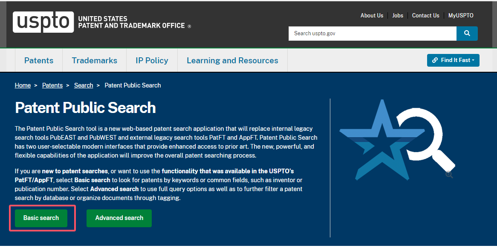

# 🆖 如何避免侵权

## 商标侵权

在书写 listing 的时候看到不认识的单词，或者翻译软件翻译不出来的单词一定要仔细检查和确认是否是别人的商标，以下是亚马逊主要销售站点的商标局，可点击查看：

[美国商标局](http://tmsearch.uspto.gov/)，[欧盟商标查询](https://euipo.europa.eu/)，[日本商标局](http://www.jpo.go.jp/)，[英国商标局](http://www.ipo.gov.uk/)，[全球商标检索](https://www.trademarkia.com/)

如果销售的是配件类要加上兼容性介词“for / compatible with / fits/ ntended for”，以 iPhone 15 手机壳为例，推荐以下两种主流写法：

1. SANSHILIU Case for iPhone 15
2. SANSHILIU  Case Compatible with iPhone 15

更多详情查看[卖家知识产权政策 - 关于商标的常见问题](https://sellercentral.amazon.com/help/hub/reference/GZUQ6GBBXQVHQKF2)

## 专利侵权

专利分为外观专利和实用专利，外观专利顾名思义就是长得不太一样就可以规避。实用专利的话就是结构或者功能性的专利，只要功能类似都算侵权。

[谷歌专利（需翻墙）](https://patents.google.com/)、[WIPO](https://designdb.wipo.int/designdb/en/index.jsp)、[美国专利局](https://www.uspto.gov/patents/search/patent-public-search)、[欧洲专利局](https://www.epo.org/en/searching-for-patents)

查找专利是一个很复杂的过程，如果你才开始进入亚马逊最好的办法就是如果市面上买这个款式的人很少或者都是一家公司就可以先不做这个产品，平时也可以多关注一些专利方面的新闻。

### 美国专利简单查询

进入美国专利局：[https://www.uspto.gov/patents/search/patent-public-search](https://www.uspto.gov/patents/search/patent-public-search)

<figure><figcaption>
美国商标局官网
</figcaption></figure>

在已知专利号的情况下在 Quick lookup 栏中输入专利号即可查询到专利情况：

<figure><figcaption>
专利号查询
</figcaption></figure>

在已知注册人、代理人、律师等信息的情况下可以在 Basic search 栏中输入相应信息：

<figure><figcaption>
拓展查询
</figcaption></figure>

### 美国专利高级查询

<figure><figcaption>
高级查询
</figcaption></figure>

在输入框中输入公式 `(搜索关键词).TI.`` `_`AND`_` ``*D*.SRC.` 点击搜索即可，比如我搜索了 dress 相关专利，就得到了 126 个专利结果，搜索结果会根据搜索词的不同而显示不同。

<figure><figcaption>
(dress).TI. <em>AND</em> *D*.SRC.
</figcaption></figure>

## 版权侵权

版权比较简单图片、文字、IP、电影等都属于版权范畴，在上架的时候尽量避免动漫人物，这类 IP 是最容易侵权的，比如：蜘蛛侠、白雪公主、米老鼠等等，更多内容可以查看亚马逊[卖家知识产权政策 - 关于版权的常见问题](https://sellercentral.amazon.com/help/hub/reference/GJLSFCSEA8C9EZYZ)

如果是遭遇到卖家的恶意版权投诉，可以[根据 DMCA 提交反通知的流程](https://sellercentral.amazon.com/help/hub/reference/G202017130)。
