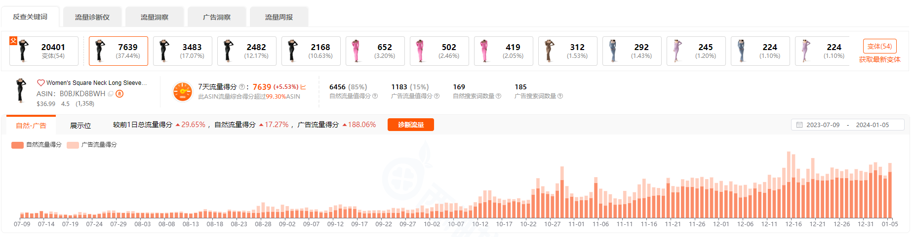
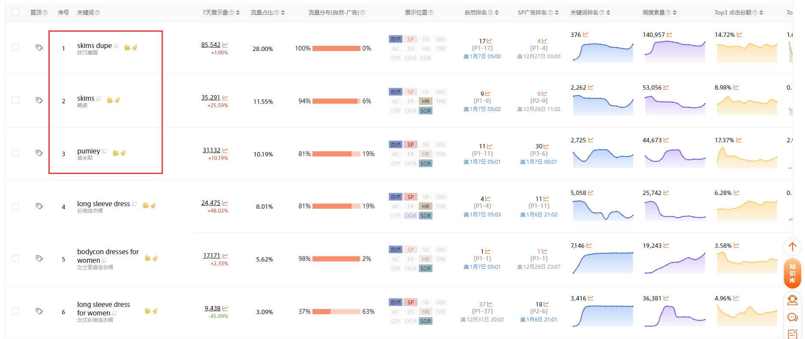
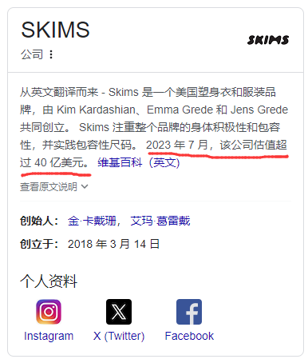
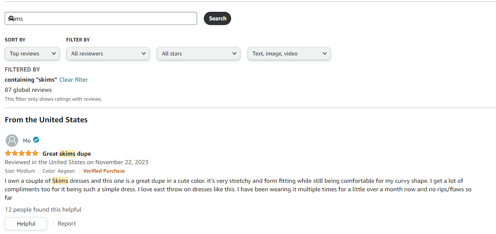
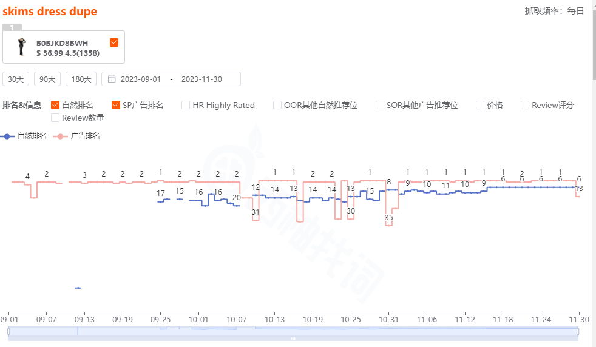
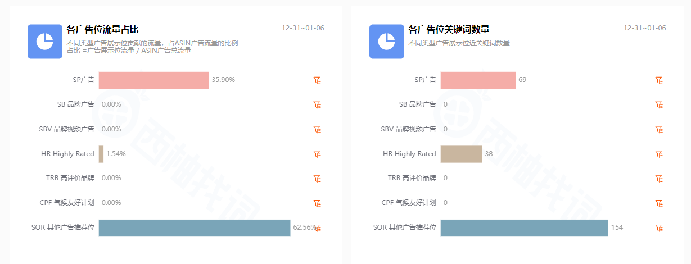

---
layout:
  title:
    visible: true
  description:
    visible: true
  tableOfContents:
    visible: true
  outline:
    visible: true
  pagination:
    visible: true
---

# 🥳 市场调研


在本章节中会使用到一些辅助软件，具体介绍访问[软件](../pei-tao-gong-ju/chang-yong-ruan-jian.md)。仅做初级判断参考，请结合自己实际情况进行操作，亚马逊运营手册提供的内容仅用于培训和测试，不保证内容的正确性。通过使用本站内容随之而来的风险与本站无关。


亚马逊官方发布了一份[《解析前台数据亚马逊新手选品攻略》](https://pan.miubay.com/s/wRSz)从前台的角度解析了如何选品，我个人比较固执的认为目前电商平台而言爆款从来都不是看数据选出来的，要么真的自己研发产品去申请专利做护城河，要么就铺产品去测款。

比如：

1. 定一个类目和人群，围绕这个方向大量快速选款，一个运营一天 3-5 个链接。然后每个连接发 3-5 个 FBA；
2. 把这个类目跑出来的好产品，有针对性的进一步扩大曝光，然后做成精品；
3. 把这些跑出来的爆款，进行包装品牌化，一个团队只负责一个产品，打造品牌。

## 产品理解

* 品牌：历史时间、注册范围、成熟度
* 款式：外观、尺寸、颜色、配件、包装
* 卖点：核心卖点、核心功能、核心服务、核心价值、核心场景、核心人群
* 成本结构：售价、FBA 配送费、包装体积

## 用户反馈

* Review：用户喜好、用户需求、产品问题
* QA：用户对产品的理解，决策过程

## 运营策略

* 链接形式：变体数量、变体形式、变体产品结构、变体流量结构（ 西柚找词 ）
* 店铺结构：链接数量、产品布局、供应链深度、运营成熟度
* 市场占有率：关键词坑位（ 卖家精灵 ）、链接销售规模、账号布局结构、上架时间

## 市场容量

* 亚马逊 ABA 数据趋势：搜索词排名（核心大词） 5 万以内证明容量不错，10 万以外量会较小；
* 使用 sorftime 进行 Best Sellers 分析，月总销量以 15 万为分界线，15 万以内的月总销量较少；
* 借助 卖家精灵 查看前 100 名的月销量判断；

## 后记

更推荐长尾市场，即 sorftime 月总销量 15 万以内的小类目；

## 选品实操

### 类目分析

我习惯使用 [Sorftime](https://www.sorftime.com/plug?tag=MjAyMjAzMDkxNzI5NDE3NDAzNzY\~) 查看类目情况（卖家精灵也有这个功能），如下图所示，显示的内容还是比较完善的，如果你准备购买这个软件的话在注册的时候可以使用邀请码：YGF3LT

<figure><figcaption>
类目分析
</figcaption></figure>

我主要关注月总销量、垄断系数、自营份额占比、退货率和转化率以及淡旺季趋势，以下是我个人的一些经验，大家可以根据自己的情况适当进行调整；

* 月总销量：20 万以下的竞争会比较小
* 垄断系数：不建议超过 50%
* 自营份额占比：低于 10%
* 退货率：低于 10%
* 转化率：高于 10%
* 淡旺季趋势：无明显季节性趋势

上架时间也可以参考一下，如果近些年上榜的产品不多，那证明这个类目迭代比较慢，想上榜比较困难；反之就是上榜虽然容易，但是维持难，各有优劣。

我的贴图是 Dress 类目的，所以退货率高达 42%，转化率却只有 2%，这么一看就很变态。但是广告 CPC 较低，不会被大卖家垄断是这个类目的优势。所以大家在分析类目的时候除了看数据之外也要结合自己的优势。

### 寻找产品

在查看 BSR 100 的时候，找到上架一年以内的，以 B0BJKD8BWH 为例作为分析，上架 400 天，评论 1375 个。

### 分析推广节奏

可以利用[卖家精灵](../pei-tao-gong-ju/chang-yong-ruan-jian.md#mai-jia-jing-ling)查看该 ASIN 的推广节奏和价格趋势判断该 ASIN 做了哪些动作，可以根据竞对的销售趋势和推广节奏指定自己的推广计划和备货计划。

<figure><figcaption>
卖家精灵
</figcaption></figure>

可以看到这个产品虽然在 2023 年的 1 月就上架了，但是直到 8 月份才慢慢开始爆发，在 8 月他是进行了降价处理从原来的 43.99 降价到了 36.99，在接下来的几个月中有几次秒杀，都是 29.99 的售价。

初步判断价格产生了一定的影响。

### 分析流量结构

我习惯先用[西柚找词](https://www.xiyouzhaoci.com/activity/channel\_register/plyk)看一下自然流量和广告流量的占比，还有就是可以看到哪个变体卖得好，也方便我们有初步的备货倾斜。

<figure><figcaption>
西柚找词
</figcaption></figure>

从这里可以看到流量在 8 月份的时候确实有一点点上升，但是不是很明显，在 10 月的时候迎来爆发，我们再继续分析他的流量来源。

<figure><figcaption></figcaption></figure>

可以看到他的前三关键词来源前两个都是别人的品牌，并且我查了一下是美国明星卡戴珊创建的品牌，Skims 在 2023 年的 7 月的时候获得了一笔投资市值 40 亿美元。

<figure><figcaption></figcaption></figure>

同时我也去翻了一下评论，大部分评论都会说比 skims 便宜，类似于平替啥的。

<figure><figcaption></figcaption></figure>

至此可以确定的是这个链接是蹭到了大牌流量，从关键词排名中可以看到是从 10 月初之后 skims dress dupe 这个词开始有自然排名并且逐步开始慢慢靠前。

<figure><figcaption></figcaption></figure>

但是不确定该产品是否存在侵权风险，大家在选产品的时候一定要注意切勿侵权。

### 分析产品矩阵

我们除了看产品之外也可以看该卖家还在卖什么产品，一般卖家做了爆款之后都会布局类目矩阵或者开发迭代的产品，我们可以看看他的店铺中是否有最近刚上架的产品，然后判断是否要跟进。

### 分析关键词

在以上分析的过程中我们就大概对关键词有印象了，可以把关键词列出来，然后再利用亚马逊后台的 ABA 排名对关键词进行分类，我通常分为 A\B\C 三个等级分别对应排名为 1 万以内、1-5 万、5 万以上。

也可以利用亚马逊后台的商机探测器进一步发掘。

### 制订推广计划

我们可以在调研类目容量的时候点开月总销量查看销量断层在第几名，然后去判断我们的销售目标应当定在什么位置，然后匹配相应的资源。

<figure><figcaption></figcaption></figure>

竟对大部分情况下都是 SP 广告，所以我们前期也可以使用 SP 为主，后期看情况再确定是否需要增加 SB\SD 等类型的广告。

<figure><figcaption></figcaption></figure>

还是那句话如果你有一定的资金就把推广节奏加快一些，多备货。如果资金不是太充裕的话可以做计划的时候保守一些，利用空运等手段降低库存成本。

### 结束语

本来还想写一些选品的标准，但是细想之前好像出过相应的课程了，更重要的是每个人都应该总结出适合自己的选品标准，而不是一味的听各路讲师的标准（包括我）。

只是不建议做泡重、高退货、粉末、带电等类型的产品，更不要想着赚快钱去做侵权的产品。

不建议大家过度依赖所谓的选品插件，虽然以上我用了很多插件，但是我只是用来辅助分析，这些软件可以大量节约我们收集数据的时间。而不是像某些卖家一样直接用软件的数据去上产品。

另外，插件不在于多，而在于你自己是否用得习惯。
