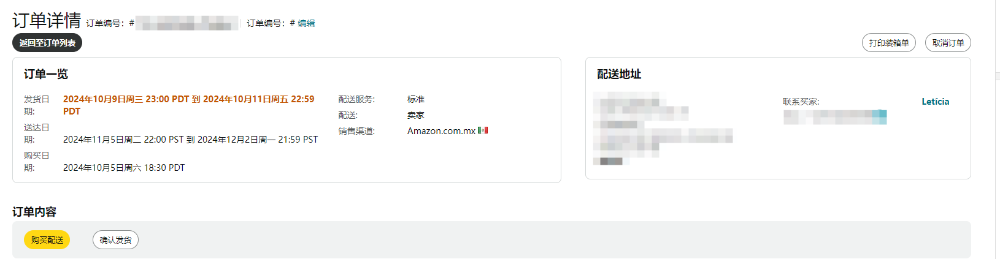

# 🚚 FBM 自发货流程

<figure><figcaption>
订单截图
</figcaption></figure>

配送时间默认是 2 个工作日，在编辑产品页面填写处理时间可以设置发货时间

自发货涉及到一些考核指标，[查看详情](../../di-liu-zhang-shu-ju-fen-xi-yu-dian-pu-you-hua/zhang-hu-zhuang-kuang.md)

发货的时候要留意客户的送货国家，以下已美国的

## 指标说明

发货日期: 2024 年 10 月 9 日周三 23:00 PDT 到 2024 年 10 月 11 日周五 22:59 PDT

必须要在太平洋时间 2024 年 10 月 11 日之前填写发货单号

送达日期: 2024 年 11 月 5 日周二 22:00 PST 到 2024 年 12 月 2 日周一 21:59 PST

必须要在太平洋时间 2024 年 12 月 02 日之前送到客户手上

## 地址说明

<figure><figcaption>
地址说明
</figcaption></figure>


国外的地址是从后面往前面算的，有时候地址会有两行，有时候洲会写全称，但是都大差不差的。电话是经过亚马逊转化过的，不是客户的真实号码。


姓名：SANSHILIU

地址：1200 LINCOLN ST NE

城市：MINNEAPOLIS

洲：MN

邮编：MN 56418-2265

国家：美国

电话（非必填）：+1 939-456-4790 ext. 00207

## 购买配送

推荐使用购买配，送可以避免因物流原因造成的绩效，还可以删除店铺反馈

## 第三方渠道发货

可以使用 4PX、云途、邮政小包等服务商进行发货

