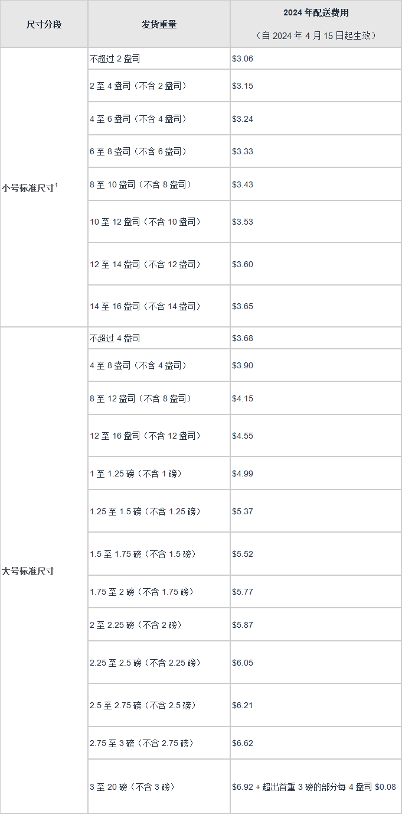

# 🥚 FBA 费用

本章节主要介绍亚马逊 FBA 可能产生的费用，所以在规划库存的时候一定要仔细计算，否认库存冗余的话将产生很多费用。

* [亚马逊物流新品入仓优惠计划](https://sellercentral.amazon.com/help/hub/reference/GWHQRT98SAZC29VQ)

## 月度仓储费

[月度仓储费](https://sellercentral.amazon.com/help/hub/reference/G3EDYEF6KUCFQTNM)是我们在亚马逊的库存体积每个月的仓储费，会根据产品的体积每月收取，通常在产生费用的次月 7 日到 15 日之间收取，在第四季度的时候会收取旺季仓储费。

<figure><figcaption>
月度仓储费
</figcaption></figure>

如果库存时间超过 180 天将会收取[超龄库存附加费](https://sellercentral.amazon.com/help/hub/reference/GJQNPA23YWVA4SBD)将于每月 15 日使用库存快照评估超龄库存附加费，这是在月度仓储费之外收取的费用。

<figure><figcaption>
超龄库存附加费
</figcaption></figure>

## 配送费

以下为亚马逊亚马逊物流配送费用（服装类商品除外），[点击查看详情](https://sellercentral.amazon.com/help/hub/reference/GPDC3KPYAGDTVDJP)


需要注意的是亚马逊配送是按照商品数量计费的，而不是订单，所以无论客户一个订单买多少件，都不会有运费的减免。


<figure><figcaption>
亚马逊物流配送费用（服装类商品除外）
</figcaption></figure>

## 退货管理费

如果买家退款，亚马逊会将您为该商品支付的销售佣金减去适用的退款管理费用后的金额。[查看详情](https://sellercentral.amazon.com/help/hub/reference/GDC3U6FWF4JJJJC7)

<figure><figcaption>
退货管理费
</figcaption></figure>

## 弃置费用

当我们的产品滞销，长期仓储费又贵的时候我们就要考虑要弃置商品了，这也会有操作费。[查看详情](https://sellercentral.amazon.com/help/hub/reference/G5FKTA8LXU4TZPD5)

在弃置之前可以尝试[促销](../jia-ge-ce-le-yu-cu-xiao/cu-xiao-shou-duan.md)方案打折处理，也可以查看[清库存的技巧](../qing-ku-cun-de-ji-qiao.md)找到合适的方案。

<figure><figcaption></figcaption></figure>

