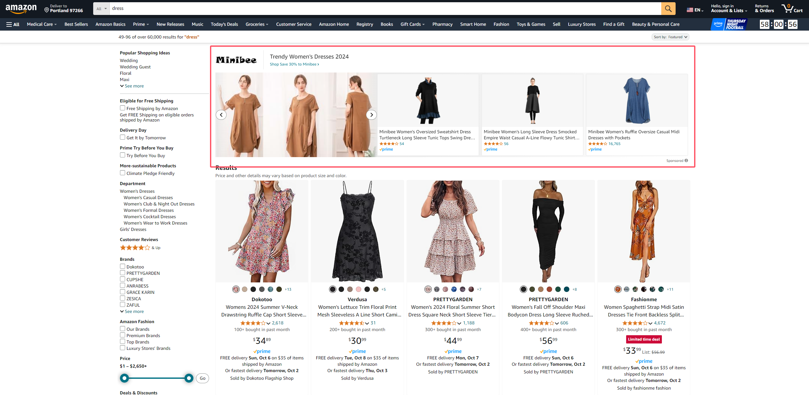

# 🙀 亚马逊广告类型介绍


每个广告类型只拿一个典型的位置举例，详情可以到后台查看相关示例


<figure><figcaption>
亚马逊广告类型
</figcaption></figure>

从左到右依次是商品广告（SP）、品牌广告（SB）、展示广告（SD）、电视广告（ST）

## 广告匹配类型

[匹配类型和投放分组](https://advertising.amazon.com/help/GHTRFDZRJPW6764R)

### 自动广告

#### 宽泛匹配

顾客使用与您的商品松散相关的搜索词进行搜索时，亚马逊广告会向其展示您的广告。假设您的商品是“Doppler 400-count Cotton Sheets”，亚马逊广告将在顾客输入“bed sheets”、“bath sheets”和“bath towels”等搜索词时展示广告。

#### 紧密匹配

顾客使用与您的商品紧密相关的搜索词进行搜索时，亚马逊广告会向其展示您的广告。假设您的商品是“Doppler 400-count Cotton Sheets”，亚马逊广告将在顾客输入“cotton sheets”和“400-count sheets”等搜索词时展示广告。

#### 同类商品

当顾客查看与您的商品类似的商品的详情页时，亚马逊会向其展示您的广告。假设您的商品是“Doppler 400-count Cotton Sheets”，亚马逊广告将在包含“300-count Cotton sheets”和“queen 400-count Sheets”的商品详情页上展示广告。

#### 关联商品

当顾客查看与您的商品关联的商品的详情页时，亚马逊会向其展示您的广告。假设您的商品是“Doppler 400-count Cotton sheets”，亚马逊广告将在包含“queen quilt”和“feather pillows”的商品详情页上展示广告。


新品刚上线没有优势的时候可以把同类商品和关联商品关闭，紧密匹配的竞价可以高一些


### 关键词广告

#### 广泛匹配

这种匹配类型可让您的广告对应顾客购物搜索词获得广泛展示机会。购物搜索词可以包含任意顺序的关键字词。它可能包括单数、复数、变体、同义词和相关字词，具体取决于关键词的含义和推广的商品的上下文。关键词本身可能不包含在顾客购物搜索词中。例如，关键词“运动鞋 (sneakers)”可能与顾客的购物搜索词相匹配，例如“帆布运动鞋 (canvas sneakers)”、“球鞋 (sneakers)”、“篮球鞋 (basketball shoes)”、“田径运动鞋 (athletic shoes)”、“防滑鞋 (cleats)”、“训练鞋 (trainers)”或“记忆棉跑鞋 (foam runners)”。


在品牌推广活动中，您可以添加广泛匹配修饰词，用于指明顾客的购物搜索词中必须出现哪些词才会展示您的广告。添加广泛匹配修饰词的方式是在关键词前添加加号“+”。例如，如果您选择广泛匹配并使用关键词“+儿童鞋 (+kids shoes)”，那么广告将仅与包含“儿童 (kids)”一词的搜索内容进行匹配。 该广告可能与“儿童运动鞋 (kids sneakers)”或“儿童跑步鞋 (running shoes for kids)”相匹配，但不会匹配任何不包含“儿童 (kids)”一词的购物搜索词，例如“运动鞋 (sneakers)”或“跑步鞋 (running shoes)”。


#### 词组匹配

在商品推广活动中，搜索词必须包含确切的词组或词序。它比广泛匹配的限制性更高，一般会让广告展示在更相关的广告位。词组匹配还会匹配关键词的复数形式。 在品牌推广活动中，这种匹配类型使广告主能够在包含其关键词含义的搜索结果中展示广告。关键词可以包含隐含的语义，而顾客的搜索结果可以显示更具体的语义形式。例如，如果广告主的词组形式的关键词为“窗帘杆 (curtain rods)”，而顾客的搜索查询内容为“卧室窗帘杆 (pole for curtains for bedroom)”，则会出现词组匹配的情况。

#### 精准匹配

在商品推广活动中，搜索词必须与关键词或词序（包括确切搜索词的近似变体）精准匹配，广告才会展示。精准匹配是限制性最高的匹配类型，但与搜索内容的相关性也更高。精准匹配还会匹配关键词的复数形式。 在品牌推广活动中，这种匹配类型使广告主能够在包含与其关键词含义相同或意图相同的搜索结果中展示广告。例如，如果广告主的精准关键词为“户外灯单数形式 (outside light)”，而客户查询 “户外灯复数形式 (outdoor lights)”，则会出现精准匹配的情况。


通常情况下广泛和词组用来跑词，精准匹配用来打关键词排名（较贵）


### ASIN 广告

精准：只在已投放的 ASIN listing 下展现广告

已扩展：投放单件商品 和与之密切相关的其他商品（包括替代商品、互补商品）， 以及能吸引消费者、与其他原始商品相关的产品。


如果不是很特殊的产品属性，只选择精准就可以


### 否定关键词匹配类型

#### 否定词组

当购物搜索词中包含完整词组或其近似变体时，广告将不会显示。每个否定关键词最多不得超过 4 个字和 80 个字符。

#### 否定精准匹配

当购物搜索词中包含确切词组或其近似变体时，广告将不会显示。每个否定关键词最多不得超过 10 个字和 80 个字符。

## 广告活动竞价策略

详细说明：[https://advertising.amazon.com/help/GCU2BUWJH2W3A8Z7](https://advertising.amazon.com/help/GCU2BUWJH2W3A8Z7)

### 动态竞价 - 仅降低

如果您选择“动态竞价 – 仅降低”方案，亚马逊将针对不太可能转化为销量的点击降低您的竞价。如果亚马逊发现您的广告不太可能转化为销量，则可能会针对该竞拍降低您的竞价。例如，如果您的广告针对不太相关的搜索查询展示或展示在效果不佳的广告位上等，都有可能会出现这种情况。

### 动态竞价 – 提高和降低

亚马逊觉得你的产品有可能出单的时候，对于**搜索结果顶部**的广告位置竞价最多上涨 100%，**搜索结果的其余位置和商品页面**的广告位置竞价最多上涨 50%。例如，对于在搜索结果首页顶部展示的机会，亚马逊最高可以将 $1.00 的竞价提高至 $2.00 ；对于在其他所有广告位上展示的机会，最高可以提高至 $1.50 。

### 固定竞价

对于固定竞价方案，亚马逊将针对所有机会使用您的精准竞价，而不会调整您的竞价。与动态竞价方案相比，固定竞价方案可能会让您的广告支出获得更多展示量，但转化量将减少。


固定竞价对打排名比较好操控位置，其他两个投产比比较好


## 根据广告位调整竞价

### 搜索结果首页首位（第一页）

指在搜索结果首页顶行的商品推广广告位。

### 搜索结果的其余位置

指位于搜索结果的中间或底部的商品推广广告位，还包括搜索结果第二页及其他页面中的所有商品推广广告位。

### 商品页面

指商品详情页上的商品推广广告位，以及所有非搜索结果广告位（例如“加入购物车”页面）。


大部分情况下首页首位的转化率是最好的


## 商品广告

SP 广告中可以投放两种类型的广告搜索词和 ASIN

### 搜索词广告

所有投放搜索词的广告都属于这类的广告，需要注意的是及时投放的搜索词广告，如果竞价不够高的话大部分也会出现在商品页面而非搜索结果页面。

### ASIN 广告

投放在别人的产品详情页下方的广告

## 品牌广告

### 品牌广告 ASIN 广告展现位置

<figure><figcaption>
品牌推广商品集搜索结果首页首位仅限 ASIN 的广告格式
</figcaption></figure>

### 视频广告展现位置

<figure><figcaption>
搜索结果中的品牌推广视频广告格式
</figcaption></figure>

## 展示广告

展示型推广可以帮助您在受众的整个购物和娱乐过程中、通过程序化展示广告触达相关受众。


这是亚马逊唯一一种可以在站外展现的广告，曝光量很大，价格也便宜，但是转化率很差


## 电视广告

帮助激发顾客在流媒体电视服务上的购物热情，例如 Prime Video、 Freevee、Twitch 和其他流媒体电视服务。作为广告活动所有者，您可以控制广告支出，这意味着没有最低支出要求，并且您可以设置每日预算上限。如果您没有电视品质的创意素材，亚马逊广告可以通过其创意服务帮助您制作电视品质的视频广告。
